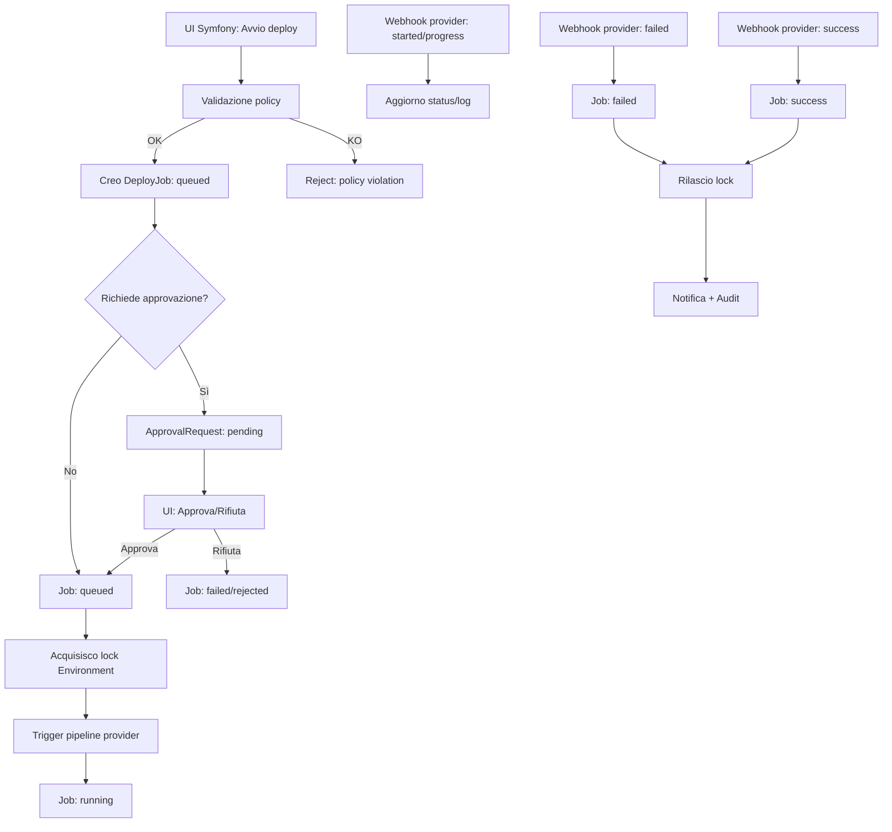

# DRAVEN Control Plane — DB Schema - Flow - Policy

## Obiettivo
Realizzare un **control-plane in Symfony 7.4** che gestisca il deploy di circa 10 progetti, ognuno con 3 ambienti (**stage, demo, produzione**), orchestrando **pipeline esterne** (Bitbucket / GitHub / GitLab) che eseguono **Deployer** su runner dedicati.

Il pannello copre:
- RBAC (permessi)
- creazione e tracciamento job
- approvazioni (soprattutto produzione)
- audit trail
- lock per ambiente (niente deploy concorrenti sulla stessa destinazione)
- log e link alla pipeline

---

## Schema DB minimo
Set di entità/relazioni minimo per Doctrine.

### 1) Project
Rappresenta un’applicazione deployabile.

**Campi**
- `id` (UUID)
- `name` (string)
- `slug` (string, unique)
- `description` (text, nullable)
- `is_active` (bool)
- `created_at`, `updated_at`

**Vincoli / indici**
- UNIQUE(`slug`)
- INDEX(`is_active`)

---

### 2) Environment
Rappresenta un ambiente deployabile di un progetto.

**Campi**
- `id` (UUID)
- `project_id` (FK → Project)
- `name` (enum: `stage|demo|prod`)
- `policy_id` (FK → Policy)
- `is_enabled` (bool)
- `lock_strategy` (enum: `none|exclusive`, default `exclusive`)
- `created_at`, `updated_at`

**Vincoli / indici**
- UNIQUE(`project_id`, `name`)

---

### 3) Policy
Definisce le regole di “cosa è deployabile” e “come”.

**Campi**
- `id` (UUID)
- `name` (string)
- `description` (text, nullable)
- `rules_json` (json)
- `created_at`, `updated_at`

**Esempi di chiavi in `rules_json`**
- `allowed_ref_types`: `["branch","tag","sha"]`
- `allowed_branches`: `["develop", "release/.*"]` (regex o glob)
- `allowed_tags`: `["v\\d+\\.\\d+\\.\\d+"]`
- `require_approval`: `true|false`
- `approvals_required`: `0|1|2`
- `require_ci_success`: `true|false`
- `allow_rollback`: `true|false`
- `allow_force_deploy`: `true|false`
- `restrict_deploy_window`: `{ "tz": "Europe/Rome", "days": [1,2,3,4,5], "from": "09:00", "to": "19:00" }`

---

### 4) RepoIntegration
Rappresenta l’integrazione del progetto con un provider SCM/CI (Bitbucket/GitHub/GitLab).

**Campi**
- `id` (UUID)
- `project_id` (FK → Project)
- `provider` (enum: `bitbucket|github|gitlab`)
- `repo_full_name` (string)  
  - es: `workspace/repo` (Bitbucket), `org/repo` (GitHub), `group/repo` (GitLab)
- `default_branch` (string, es: `main`)
- `pipeline_selector` (string/json, nullable)  
  - mapping “ambiente → workflow/pipeline template”
- `webhook_secret` (string, nullable)  
  - riferimento a secret manager
- `credential_ref` (string, nullable)  
  - riferimento a token/app installation in vault/secret store
- `is_active` (bool)
- `created_at`, `updated_at`

**Vincoli / indici**
- UNIQUE(`provider`, `repo_full_name`) (opzionale)
- INDEX(`project_id`, `is_active`)

---

### 5) DeployJob
Richiesta di deploy (o rollback) tracciata end-to-end.

**Campi**
- `id` (UUID)
- `project_id` (FK → Project)
- `environment_id` (FK → Environment)
- `integration_id` (FK → RepoIntegration)
- `type` (enum: `deploy|rollback|dry_run`)
- `ref_type` (enum: `branch|tag|sha`)
- `ref_name` (string)  
  - es: `develop`, `v1.2.3`, oppure SHA
- `commit_sha` (string, nullable)
- `requested_by_user_id` (FK → User)
- `requested_at` (datetime)
- `status` (enum: `queued|waiting_approval|running|success|failed|canceled|expired`)
- `locked_at` (datetime, nullable)
- `started_at` (datetime, nullable)
- `finished_at` (datetime, nullable)
- `external_run_id` (string, nullable)  
  - id pipeline/workflow run
- `external_run_url` (string, nullable)
- `summary` (string, nullable)
- `error_message` (text, nullable)

**Vincoli / indici**
- INDEX(`status`)
- INDEX(`environment_id`, `requested_at`)
- INDEX(`project_id`, `requested_at`)

---

### 6) ApprovalRequest
Richiesta di approvazione legata a un job.

**Campi**
- `id` (UUID)
- `job_id` (FK → DeployJob, UNIQUE)
- `required_count` (int)
- `status` (enum: `pending|approved|rejected|canceled`)
- `created_at`, `updated_at`

**Vincoli**
- UNIQUE(`job_id`)

---

### 7) ApprovalDecision
Singola decisione di un approvatore.

**Campi**
- `id` (UUID)
- `approval_request_id` (FK → ApprovalRequest)
- `user_id` (FK → User)
- `decision` (enum: `approved|rejected`)
- `note` (text, nullable)
- `decided_at` (datetime)

**Vincoli / indici**
- UNIQUE(`approval_request_id`, `user_id`)

---

### 8) DeployLogLine (opzionale)
Log centralizzati in alternativa al solo link esterno.

**Campi**
- `id` (bigint auto increment, oppure UUID)
- `job_id` (FK → DeployJob)
- `seq` (int)  
  - progressivo per ordinare
- `stream` (enum: `stdout|stderr|event`)
- `message` (text)
- `created_at` (datetime)

**Indici**
- INDEX(`job_id`, `seq`)

---

### 9) EnvironmentLock
Lock esclusivo per impedire deploy concorrenti sullo stesso ambiente.

**Campi**
- `environment_id` (FK → Environment, PK)
- `job_id` (FK → DeployJob)
- `locked_at` (datetime)
- `expires_at` (datetime, nullable)

**Vincoli**
- PK(`environment_id`)

---

### 10) User
Utente Symfony standard, con due approcci per il controllo accessi:
- approccio base: `roles` JSON sullo user (`ROLE_DEPLOY_STAGE`, `ROLE_DEPLOY_DEMO`, `ROLE_DEPLOY_PROD`, `ROLE_APPROVE_PROD`)
- approccio strutturato: tabelle `role` e `permission`

---

## Relazioni principali (riassunto)
- Project 1—N Environment
- Project 1—N RepoIntegration
- Environment N—1 Policy
- DeployJob N—1 Project
- DeployJob N—1 Environment
- DeployJob N—1 RepoIntegration
- DeployJob 1—0..1 ApprovalRequest
- ApprovalRequest 1—N ApprovalDecision
- DeployJob 1—N DeployLogLine
- Environment 1—0..1 EnvironmentLock

---

## Diagramma del flusso
Flusso di riferimento: **UI → job → provider → webhook**.

### Flow (Mermaid)


### Sequenza eventi (pratica)
1. **Create job**: salvo `DeployJob(queued)`
2. **Approval gate** (solo se richiesto): `waiting_approval` → `queued`
3. **Lock**: inserisco `EnvironmentLock` (PK su environment)
4. **Trigger**: chiamo API provider per avviare pipeline/workflow e salvo `external_run_id/url`
5. **Webhook**: ricevo eventi (running/success/fail) e aggiorno job + log
6. **Unlock**: cancello `EnvironmentLock`
7. **Notify**: Slack/Teams/mail (opzionale)

---

## Policy baseline per i 3 ambienti
Policy pronte all’uso e personalizzabili per progetto.

### 1) Policy STAGE
**Scopo**: integrazione rapida, rilasci frequenti.

**Regole di base**
- Ref consentiti: `branch` (+ opzionale `sha`)
- Branch consentiti: `develop`, `feature/.*`, `bugfix/.*`
- Approvazione: **no**
- CI richiesto: **sì** (almeno build/test verdi sul ref)
- Finestra oraria: opzionale
- Rollback: **sì**

**Esempio rules_json**
```json
{
  "allowed_ref_types": ["branch", "sha"],
  "allowed_branches": ["develop", "feature/.*", "bugfix/.*"],
  "require_approval": false,
  "approvals_required": 0,
  "require_ci_success": true,
  "allow_rollback": true,
  "allow_force_deploy": true
}
```

---

### 2) Policy DEMO
**Scopo**: ambiente dimostrativo/stabile con rilasci controllati.

**Regole di base**
- Ref consentiti: `branch` (es: `main`) oppure `tag`
- Branch consentiti: `main` (o `release/.*` se presenti release branches)
- Approvazione: opzionale (es. 1 approvazione se demo è esposta a clienti)
- CI richiesto: **sì**
- Rollback: **sì**
- Force deploy: **no** (o limitato agli admin)

**Esempio rules_json**
```json
{
  "allowed_ref_types": ["branch"],
  "allowed_branches": ["main", "release/.*"],
  "require_approval": true,
  "approvals_required": 1,
  "require_ci_success": true,
  "allow_rollback": true,
  "allow_force_deploy": false
}
```

---

### 3) Policy PRODUZIONE
**Scopo**: massima sicurezza e tracciabilità.

**Regole di base**
- Ref consentiti: **solo `tag`** (versioning)
- Tag consentiti: `vMAJOR.MINOR.PATCH` (es: `v1.4.2`) oppure `YYYY.MM.DD`
- Approvazione: **sì** (almeno 1; 2 su sistemi critici)
- CI richiesto: **sì** (pipeline verde sul tag)
- Finestra oraria: es. lun–ven 09:00–19:00, Europe/Rome
- Rollback: **sì** (task standard)
- Force deploy: disabilitato (o limitato a super-admin con audit aggiuntivo)

**Esempio rules_json**
```json
{
  "allowed_ref_types": ["tag"],
  "allowed_tags": ["v\\d+\\.\\d+\\.\\d+"],
  "require_approval": true,
  "approvals_required": 2,
  "require_ci_success": true,
  "allow_rollback": true,
  "allow_force_deploy": false,
  "restrict_deploy_window": {
    "tz": "Europe/Rome",
    "days": [1,2,3,4,5],
    "from": "09:00",
    "to": "19:00"
  }
}
```

---

## Nota operativa: integrazione multi-provider (Bitbucket/GitHub/GitLab)
Per supportare più provider si utilizza un’astrazione:
- ogni `RepoIntegration` conosce provider, repo e modalità di trigger della pipeline
- ogni `DeployJob` punta a una `RepoIntegration`

Applicazione pratica:
- in Symfony sono salvati `provider`, `repo_full_name`, e una `pipeline_selector` per scegliere il workflow/pipeline per `stage|demo|prod`
- al momento della creazione del job viene triggerata la pipeline passando variabili standard: `JOB_ID`, `ENV`, `REF`, `TYPE`
- il runner esegue Deployer e notifica Symfony via webhook con `JOB_ID`

---

## Checklist v1
- CRUD: Project, Environment, RepoIntegration, Policy
- Creazione job: deploy / rollback / dry-run
- Lock per ambiente
- Approval gate per demo/prod
- Webhook receiver con firma (secret)
- Stato job + link esterno ai log (centralizzare i log in v2 se serve)
